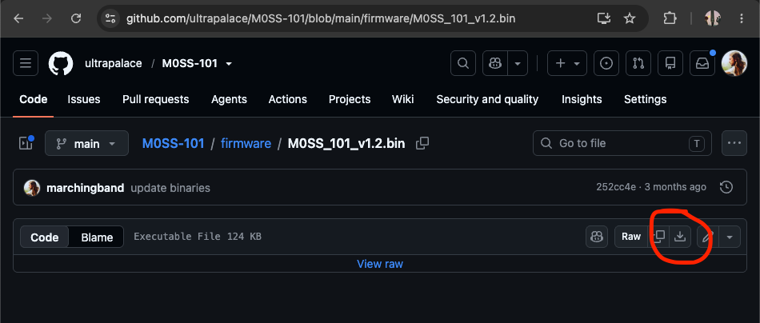
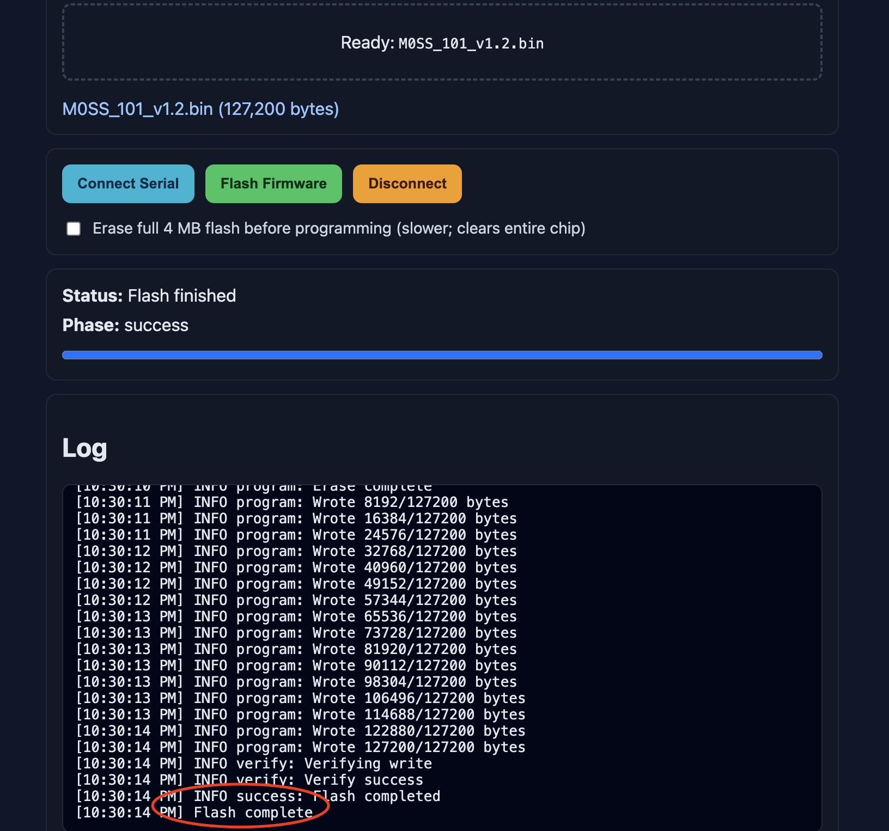

# M0SS-101 Firmware Update Guide

> NOTE: Updating the Firmware will usually result in the loss of your Presets

## STEP 1: Download the firmware image to your computer.
- The firmware Images are located in the `firmware` directory of this repository.
- You can read the [version notes](https://github.com/ultrapalace/M0SS-101/blob/main/version-notes.md) to pick the one you want to use.
- Download it to a good spot on your computer.

## STEP 2: Connect the M0SS-101
- Remove all the jacks from the M0SS-101
- Remove the 4 screws
- Remove the nut on the 1/4" Audio Jack
- Gently remove the guts of the M0SS-101
- Look for a small USB-B jack near the USB-A Host jack
- Using a USB-B cable, connect your computer to this small USB-B jack.
- Connect your 9v PSU to provide power to the M0SS-101
- It should look like this:

## STEP 3: Place M0SS-101 in bootloader mode
- Above the FFC cables, you will see 2 buttons labeled `BOOT` and `RST`.
- Hold the `BOOT` button down, and then click (press and release) the `RST` button. Finally release the `BOOT` button.

## STEP 4: Setup the M0SS Web Flasher utility
- Using Google Chrome (or another browser that supports WebUSB), open [https://philmillman.github.io/M0SSFlash/](https://philmillman.github.io/M0SSFlash/)
- click `Drop a .bin file here or click to browse` and select the image file you downloaded to your computer
- click `Connect Serial`, and select `Bouffalo CDC Demo` (this is the M0SS-101)

## STEP 5: Flash the firmware image
- click `Flash Firmware`
- watch the logs appear, the last log should say `Flash complete`

## STEP 6: Reset the M0SS-101
- disconnect power
- disconnect USB
- reassemble M0SS-101