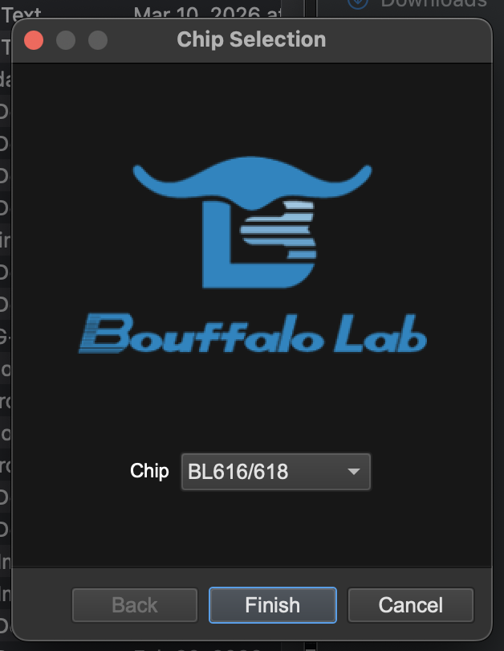
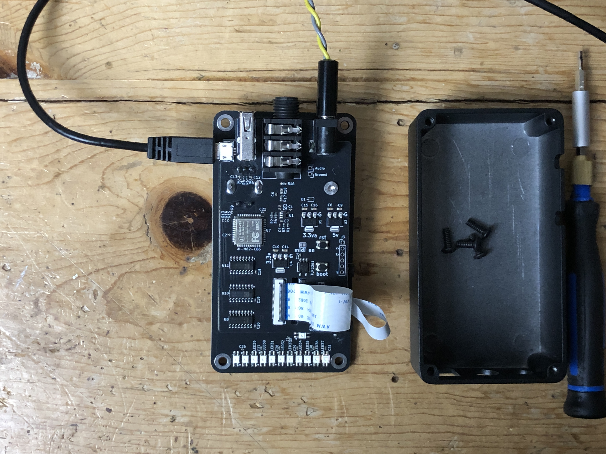
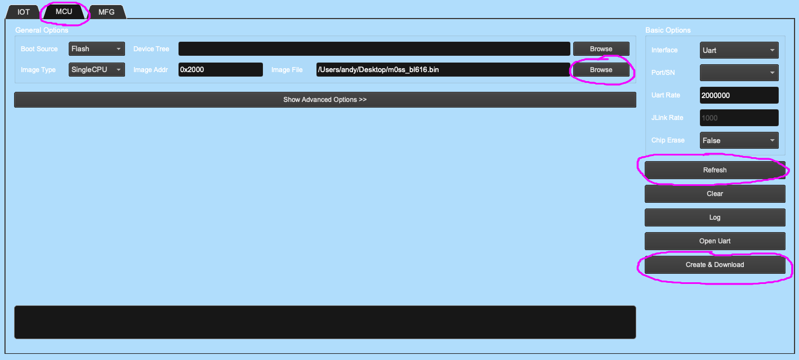
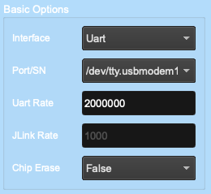
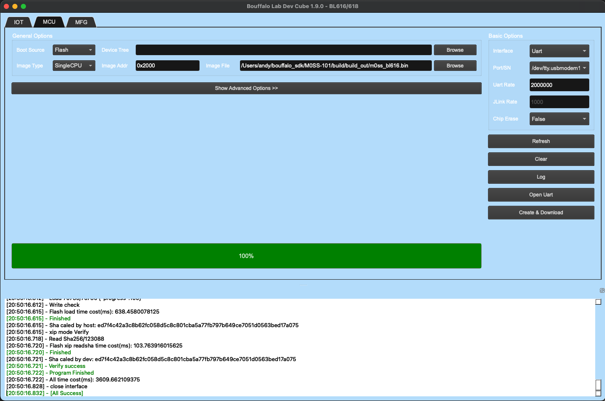

# M0SS-101 Firmware Update Guide

NOTE: Updating the Firmware will usually result in the loss of your Presets

## STEP 1: Download the firmware image to your computer.
- The firmware Images are located in the `firmware` directory of this repository.
- Download it to a good spot on your computer.

## STEP 2: Install Bouffalo Lab Dev Cube
- Open [https://dev.bouffalolab.com/download](https://dev.bouffalolab.com/download)
- Scroll down to Bouffalo Lab Dev Cube, it should be version 1.9.0, and download it.

## STEP 3: Launch Bouffalo Lab Dev Cube
- This application is VERY slow to launch, on my Mac M1 it takes about 30 seconds ... be patient!
- you should see this screen

- You want BL616/618

## STEP 4: Connect the M0SS-101
- Remove all the jacks from the M0SS-101
- Remove the 4 screws
- Remove the nut on the 1/4" Audio Jack
- Gently remove the guts of the M0SS-101
- Look for a small USB-B jack near the USB-A Host jack
- Using a USB-B cable, connect your computer to this small USB-B jack.
- Connect your 9v PSU to provide power to the M0SS-101
- It should look like this:

## STEP 5: Place M0SS-101 in bootloader mode
- Above the FFC cables, you will see 2 buttons labeled `BOOT` and `RST`.
- Hold the `BOOT` button down, and then click (press and release) the `RST` button. Finally release the `BOOT` button.

## STEP 6: Setup the Bouffalo Lab Dev Cube

- click the `MCU` tab at the top
- click `Browse` for image file, and select the image file you downloaded to your computer
- click `Refresh`, and then `PORT/SN` should show a USB port (this is the M0SS-101)

## STEP 6: Flash the firmware image

- click `CREATE AND DOWNLOAD`
- watch the logs appear, the last log should say `[all success]` and things should turn green

